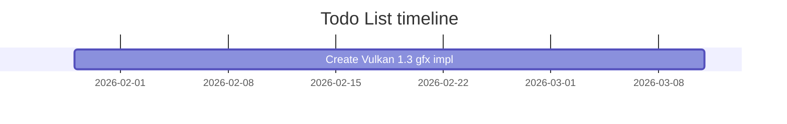

# BTZC_game_engine
Bozzy-Thea Zelda-like Collectathon Game Engine. Simple to get off the ground.

## Gallery.

*Simple OBJ loader with hacky lighting and a flying camera. (2025/05/22)*

## Software Versions.
- Clang 20.1.4
- OpenGL 4.5 (In the future Vulkan 1.3)
- Blender 3.2.2
    > @NOTE: For macOS and future, perhaps using the LTS version (3.3) would be better? Try it out and see.
- Milton 1.9.1
- FMOD Engine 2.03

## Build gotchas.

### FMOD

Install the same FMOD version in "Software Versions" and set `FMOD_STUDIO_API_DIR` in the env vars to the root dir of the API directory.

> @NOTE: I know it says FMOD Studio in the name of the env var, but just ignore that. It's just FMOD Engine. It _may_ become FMOD Studio in the future, however.

## 0.1.0-develop.2 (NEXT VERSION, WIP)

### Adds

- TODO vv
- Job system (for fast transform hierarchy updating for now).

### Changes

- TODO vv
- Physics objs when created are dummy phys objs and using the deserialize or other creation methods do they actually do something in the physics world.

### Fixes

- TODO vv
- World Peace.

## Ideas.

- Base the engine setup and execution flow off the Unity execution flowchart.
    - I do have some thinking to do about why there is an animator update in both the physics and rendering parts and what that could do there.

## Todo List.

- [x] Get basic renderer assembled.
- [x] Get jolt physics working with renderer.
- [x] Orbit camera and movement for player character.
- [x] Some misc pleasing things.
- [x] Code review.
- [x] Some misc pleasing things (cont.).
- [x] Level saving/loading.
- [x] Refactor scripts.
- [x] Level saving/loading (cont.)
- [x] Window icon.
- [x] Refactor? (transform hierarchy)
- [x] Debug views.
- [x] DEFERRED: Lower priority refactor?
- [x] Release v0.1.0-develop.1
- [x] Gameplay work (not engine work rly).
- [x] Skeletal animations using compute shaders.
- [x] Misc logger-related bugfixes.
- [ ] Create Vulkan 1.3 gfx impl; remove OpenGL 4.5 gfx impl.
- [ ] Some things I want to create!!!! (script->EnTT ecs, editor improvements, AFA editor/runtime improvements)
- [ ] ~~Unity to this engine migration.~~
- [ ] Trenchbroom `.map` loader.
- [ ] Move from GLSL to SLANG shaders.
- [ ] Graphics library procedure abstraction (basic).
- [ ] Swordplay combat.
- [ ] Refactor: materials attached to mesh -> material set system.
- [ ] Small concerns.
- [ ] Level authoring tools.
- [ ] Add cascaded shadow maps to renderer.
    - Nice shadow biasing post: https://www.reddit.com/r/GraphicsProgramming/s/p2HXNVNAXl
- [ ] PBR Implementation.

